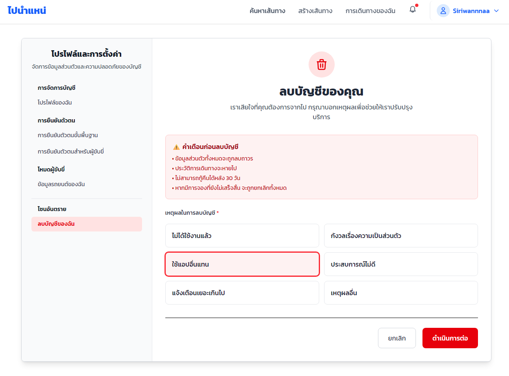
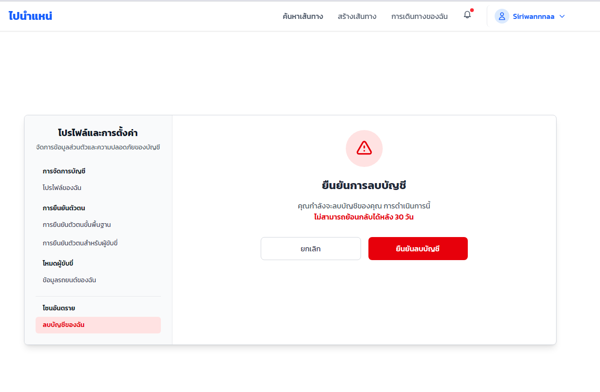
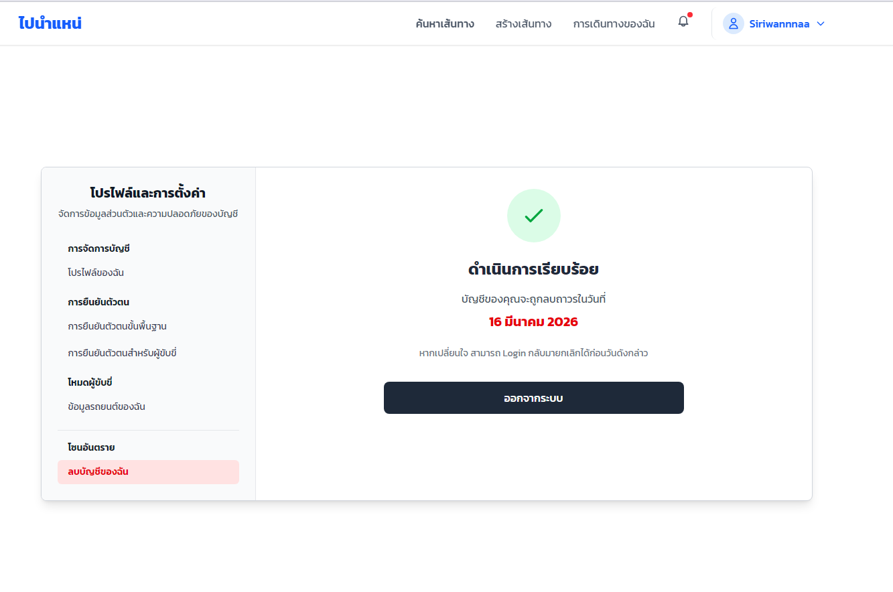
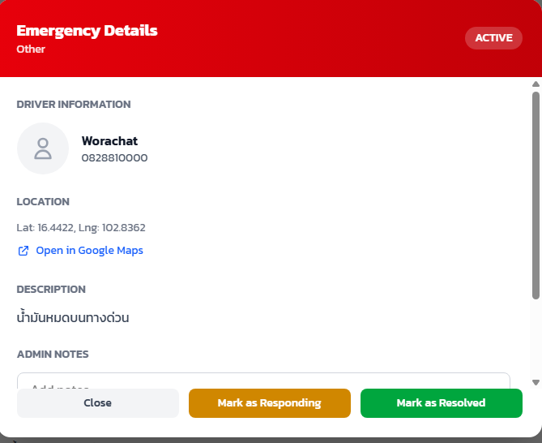
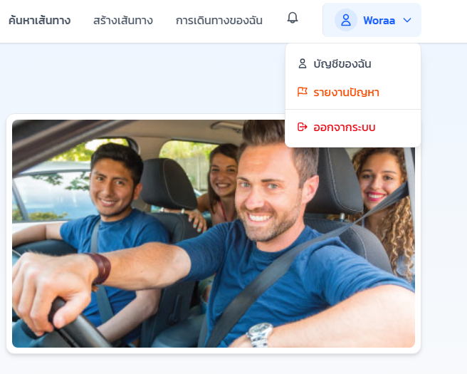
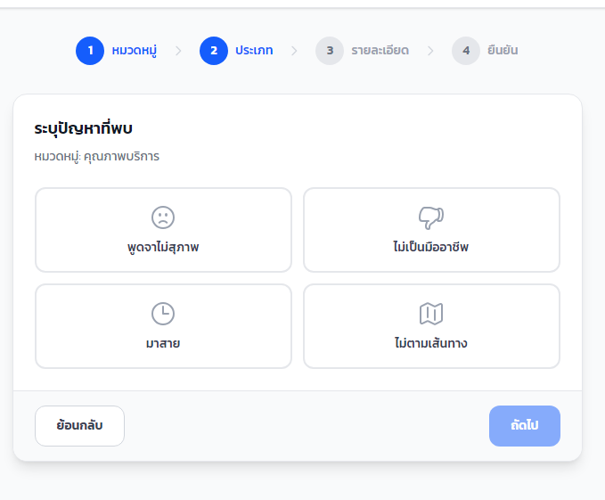
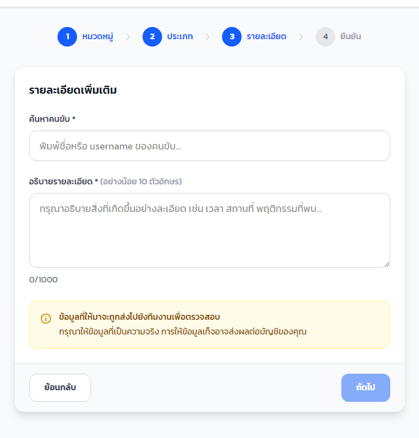

# คู่มือการใช้งานระบบ (User Manual)

## ฟังก์ชัน: การลบบัญชีผู้ใช้งาน

1️⃣ ภาพรวมของระบบ

    ระบบ “ไปนำแน่” เปิดให้ผู้ใช้งานสามารถจัดการข้อมูลบัญชีของตนเองได้ เช่น

        แก้ไขโปรไฟล์

        ยืนยันตัวตน

        ลบบัญชีผู้ใช้

    การลบบัญชีเป็นกระบวนการที่ต้องยืนยันตัวตน และไม่สามารถย้อนกลับได้หลังครบกำหนด 30 วัน

2️⃣ การเข้าสู่เมนูลบบัญชี

    เข้าสู่ระบบ

    คลิกที่ชื่อผู้ใช้มุมขวาบน เข้าสู่หน้าโปรไฟล์

    เลือก โปรไฟล์และการตั้งค่า

    เลือกเมนู ลบบัญชีของฉัน (โซนอันตราย)

3️⃣ ขั้นตอนการลบบัญชี

    ขั้นตอนที่ 1: อ่านคำเตือน

        ระบบจะแสดงข้อความเตือนว่า:

        ข้อมูลทั้งหมดจะถูกลบถาวร

        ประวัติการเดินทางจะหายไป

        ไม่สามารถกู้คืนได้หลัง 30 วัน

        หากมีการจองที่ยังไม่เสร็จสิ้นจะถูกยกเลิก

        ผู้ใช้ต้องอ่านและทำความเข้าใจก่อนดำเนินการต่อ

    ขั้นตอนที่ 2: เลือกเหตุผลในการลบบัญชี

        ผู้ใช้ต้องเลือกเหตุผล 1 ข้อ เช่น:

        ไม่ได้ใช้งานแล้ว

        กังวลเรื่องความเป็นส่วนตัว

        ใช้แอปอื่นแทน

        ประสบการณ์ไม่ดี

        แจ้งเตือนเยอะเกินไป

        เหตุผลอื่น

        จากนั้นกดปุ่ม ดำเนินการต่อ

    ขั้นตอนที่ 3: ยืนยันตัวตนด้วย OTP

        ระบบจะส่งรหัส OTP 6 หลักไปยังเบอร์โทรศัพท์ที่ลงทะเบียนไว้

        กรอกรหัส OTP ภายในเวลาที่กำหนด (5 นาที)

        หากรหัสถูกต้อง กดปุ่ม ยืนยัน

        หมายเหตุ: หากหมดเวลา สามารถกดส่ง OTP ใหม่ได้

    ขั้นตอนที่ 4: ยืนยันการลบบัญชี

        ระบบจะแสดงหน้าสรุปว่า:

        บัญชีจะถูกลบในวันที่กำหนด (ภายใน 30 วัน)

        ผู้ใช้สามารถ Login กลับมาเพื่อยกเลิกการลบก่อนครบกำหนด

        กดปุ่ม ออกจากระบบ เพื่อสิ้นสุดกระบวนการ

4️⃣ การยกเลิกการลบบัญชี

    หากผู้ใช้เปลี่ยนใจ:

        เข้าสู่ระบบอีกครั้งก่อนครบ 30 วัน

        ระบบจะยกเลิกคำขอลบบัญชีโดยอัตโนมัติ

        สามารถใช้งานบัญชีได้ตามปกติ

5️⃣ เงื่อนไขสำคัญ

    การลบบัญชีถาวรหลังครบ 30 วัน

        ไม่สามารถกู้คืนข้อมูลหลังลบถาวร

        ข้อมูลธุรกรรมและประวัติจะถูกลบทั้งหมด

        ต้องยืนยันตัวตนทุกครั้งก่อนลบ 

## ฟังก์ชัน: Emergency SOS

1️⃣ ภาพรวมของฟังก์ชัน

    ระบบ SOS (Emergency Request) ถูกออกแบบมาเพื่อให้ผู้ใช้งานสามารถแจ้งเหตุฉุกเฉินได้ทันที โดย:

        แจ้งทีมงานแบบเรียลไทม์

        ส่งพิกัดตำแหน่งปัจจุบันอัตโนมัติ

        ระบุประเภทเหตุฉุกเฉิน

        ให้แอดมินติดตามและจัดการสถานะได้

2️⃣ การใช้งานสำหรับผู้ใช้งาน (User Side)
    ขั้นตอนที่ 1: กดปุ่ม SOS

        ที่หน้าหลักจะมีปุ่ม SOS สีแดง มุมขวาล่าง

        เมื่อกด ระบบจะแสดงหน้า Emergency SOS

    ขั้นตอนที่ 2: เลือกประเภทเหตุฉุกเฉิน

        ผู้ใช้เลือกประเภทเหตุ เช่น:

        อุบัติเหตุ

        เจ็บป่วย

        ถูกคุกคาม

        อื่นๆ

        สามารถกรอกรายละเอียดเพิ่มเติมได้ในช่องข้อความ

    ขั้นตอนที่ 3: ตรวจสอบตำแหน่ง

        ระบบจะแสดงข้อความ:

        ตำแหน่งของคุณพร้อมส่ง

        คำเตือน: ใช้เฉพาะกรณีฉุกเฉินจริงเท่านั้น

    ขั้นตอนที่ 4: กดส่งคำขอ

        กดปุ่ม ส่ง SOS

        เมื่อส่งสำเร็จ ระบบจะแสดงหน้าสำเร็จ

        ข้อความแสดง:

        ทีมงานได้รับการแจ้งเตือนแล้ว กรุณารอความช่วยเหลือ

3️⃣ การจัดการฝั่งผู้ดูแลระบบ (Admin Side)
    หน้า Dashboard Emergency Requests

        แอดมินสามารถดูภาพรวมได้ เช่น:

        Active (กำลังรอดำเนินการ)

        Responding (กำลังเข้าช่วยเหลือ)

        Resolved (แก้ไขแล้ว)

        Total (ทั้งหมด)

    รายการเหตุฉุกเฉิน

        แสดงข้อมูล:

        ชื่อผู้แจ้ง

        ประเภทเหตุ

        วันที่และเวลา

        สถานะ (ACTIVE / RESOLVED)

        สามารถค้นหาและกรองข้อมูลได้

    ดูรายละเอียดเหตุฉุกเฉิน

        เมื่อกด View จะเห็นรายละเอียด:

        ข้อมูลผู้แจ้ง

        เบอร์โทร

        พิกัด (Lat, Lng)

        ลิงก์เปิด Google Maps

        คำอธิบายเหตุการณ์

4️⃣ การเปลี่ยนสถานะเหตุการณ์

        แอดมินสามารถกด:

        Mark as Responding เปลี่ยนสถานะเป็น RESPONDING

        Mark as Resolved ปิดเคส และเปลี่ยนสถานะเป็น RESOLVED

## ฟังก์ชัน: รายงานพฤติกรรมคนขับ (Report Driver)

1️⃣ ภาพรวมของฟังก์ชัน

    ระบบ รายงานพฤติกรรมคนขับ (Driver Report) ถูกออกแบบมาเพื่อให้ผู้โดยสารสามารถแจ้งปัญหาที่พบจากการใช้บริการได้ โดย:

        เลือกหมวดหมู่ปัญหาได้อย่างชัดเจน

        ระบุประเภทปัญหาอย่างละเอียด

        กรอกรายละเอียดเหตุการณ์

        ตรวจสอบข้อมูลก่อนส่งรายงาน

        ให้ผู้ดูแลระบบติดตามและจัดการสถานะได้

2️⃣ การใช้งานสำหรับผู้ใช้งาน (User Side)
    ขั้นตอนที่ 1: เข้าเมนูรายงานปัญหา

        เข้าสู่ระบบ

        คลิกชื่อผู้ใช้มุมขวาบน

        เลือกเมนู รายงานปัญหา

        หรือกดที่หน้าโปรไฟล์
        
        และเลือกรายงานปัญหาคนขับ

    ขั้นตอนที่ 2: เลือกหมวดหมู่ปัญหา

        ระบบจะแสดงหน้ารายงานพฤติกรรมคนขับ ให้เลือกหมวดหมู่ที่ต้องการ เช่น:

        พฤติกรรมการขับขี่

        สภาพรถ

        คุณภาพบริการ

        ความปลอดภัย

        ปัญหาการเงิน

        อื่นๆ

    ขั้นตอนที่ 3: เลือกประเภทปัญหา

        หลังจากเลือกหมวดหมู่ ระบบจะแสดงประเภทปัญหาในหมวดนั้น เช่น

        ตัวอย่าง: หมวดพฤติกรรมการขับขี่

        ขับรถเร็วเกินไป

        ขับรถประมาท

        ใช้โทรศัพท์ขณะขับรถ

        (หมายเหตุ: หมวดอื่น ๆ จะแสดงประเภทปัญหาตามหมวดที่เลือก)

    ขั้นตอนที่ 4: กรอกรายละเอียดเพิ่มเติม

        ผู้ใช้ต้องกรอกข้อมูลดังนี้:

        ค้นหาชื่อคนขับ

        อธิบายรายละเอียดเหตุการณ์ (อย่างน้อย 10 ตัวอักษร)

        ระบบจะแจ้งเตือนให้กรอกข้อมูลตามความเป็นจริง

    ขั้นตอนที่ 5: ตรวจสอบข้อมูลก่อนส่ง

        ระบบจะแสดงหน้าสรุปข้อมูล ได้แก่:

        หมวดหมู่

        ประเภทปัญหา

        ชื่อคนขับที่ถูกรายงาน

        รายละเอียดเหตุการณ์

        ผู้ใช้สามารถกดย้อนกลับเพื่อแก้ไข หรือกด ส่งรายงาน

    ขั้นตอนที่ 6: ส่งรายงาน

        เมื่อกด ส่งรายงาน
        ข้อมูลจะถูกบันทึกเข้าสู่ระบบ และส่งให้ผู้ดูแลตรวจสอบ

3️⃣ การจัดการฝั่งผู้ดูแลระบบ (Admin Side)
    หน้า Driver Reports Dashboard ผู้ดูแลระบบสามารถดูภาพรวมของรายงานทั้งหมด เช่น:

        Pending

        Reviewing

        Resolved

        Dismissed

        Total

4️⃣ การจัดการสถานะรายงาน

    ผู้ดูแลระบบสามารถ:

        เปลี่ยนสถานะเป็น Reviewing

        เปลี่ยนสถานะเป็น Resolved

        ปฏิเสธรายงาน (Dismissed)

        ทุกการเปลี่ยนสถานะจะถูกบันทึกในระบบเพื่อการติดตาม